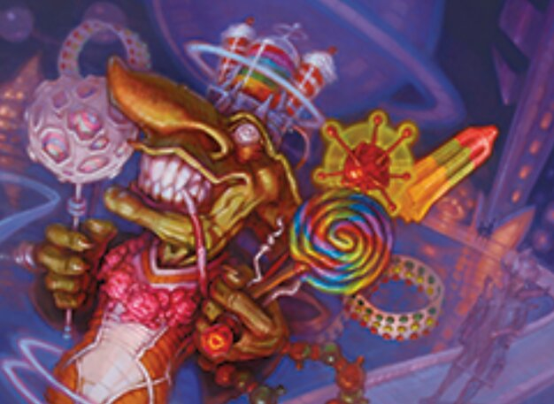

# Sticker Goblin

A desktop app for picking three random Unfinity name sticker sheets and finding the word with the most vowels. Built for **Windows**, with **Linux** support when running from source.



## How it works

1. Click **Press to get stickers!**
2. Three random sticker sheets are drawn.
3. Every sticker word from those sheets is listed with its vowel count.
4. The word(s) with the **highest vowel count** win.

## Features

- **Light & dark themes** — toggle with the pill in the header
- **Theme persistence** — your choice is remembered between sessions
- **Results panel** — sticker names, vowel counts, and highlighted winners
- **Info tooltip** — after a roll, hover the **ⓘ** icon in the Results panel to see which sheets were drawn and which stickers came from each
- **Roll sound** — roulette-style ticks while shuffling (Windows only)
- **Portable `.exe`** — Windows build, no Python install required

## Download (Windows)

Grab `StickerGoblin.exe` from the [latest release](https://github.com/KeywizZ/StickerPregame/releases) and run it.

**Requirements:** Windows 10 or later

## Run from source

### Windows

**Prerequisites:** Python 3.10+, [Pillow](https://pypi.org/project/pillow/)

```bash
git clone https://github.com/KeywizZ/StickerPregame.git
cd StickerPregame
python -m venv .venv
.venv\Scripts\activate
pip install pillow
python main.py
```

Or:

```bash
python -m stickergoblin
```

### Linux

**Prerequisites:** Python 3.10+, Pillow, and Tkinter (`python3-tk` on Debian/Ubuntu)

```bash
git clone https://github.com/KeywizZ/StickerPregame.git
cd StickerPregame
python3 -m venv .venv
source .venv/bin/activate
pip install pillow
python main.py
```

On Debian/Ubuntu, install Tkinter first if needed:

```bash
sudo apt install python3-tk
```

> **Note:** Roll sound is not available on Linux. All other features work the same.

## Build

### Windows

Double-click `build.bat` or run from the project folder:

```bash
build.bat
```

The script creates a venv (if needed), installs dependencies, builds with PyInstaller, and copies **`StickerGoblin.exe`** to the project root. Attach it to a [GitHub Release](https://github.com/KeywizZ/StickerPregame/releases) when publishing an update. Built `.exe` files are gitignored.

Manual build:

```bash
pip install pyinstaller pillow
pyinstaller StickerGoblin.spec
copy dist\StickerGoblin.exe StickerGoblin.exe
```

### Linux

There is no Linux build script. Run from source (see above), or build a standalone binary with PyInstaller on Linux:

```bash
python3 -m venv .venv
source .venv/bin/activate
pip install pyinstaller pillow
pyinstaller StickerGoblin.spec
```

The output will be in `dist/StickerGoblin` (no `.exe` extension).

## Project structure

```
StickerPregame/
├── main.py                  # Entry point (runs the app)
├── build.bat                # Build script (outputs StickerGoblin.exe to project root)
├── StickerGoblin.exe        # Built Windows app (generated by build.bat, gitignored)
├── stickergoblin/           # Application package
│   ├── __init__.py          # Package exports
│   ├── __main__.py          # `python -m stickergoblin` entry
│   ├── app.py               # Main window and game logic
│   ├── config.py            # Constants, themes, layout sizes
│   ├── paths.py             # Resource paths and user config
│   ├── theme.py             # Theme manager (light/dark styling)
│   ├── widgets.py           # Custom UI widgets (pill toggle, info button, tooltip)
│   ├── sound.py             # Roll tick sound effects
│   └── images.py            # Pillow availability helper
├── data.json                # Sticker sheet data (words, vowel counts, image paths)
├── images/                  # Sticker sheet images
├── assets/                  # App icon, artwork, and sound files
├── StickerGoblin.spec       # PyInstaller build config
├── build/                   # PyInstaller build cache (generated)
└── dist/                    # PyInstaller output (generated)
```

## Configuration

Theme and sound preferences are saved automatically.

**Windows:**

```
%APPDATA%\StickerGoblin\config.json
```

**Linux (from source):**

```
<project folder>/config.json
```
